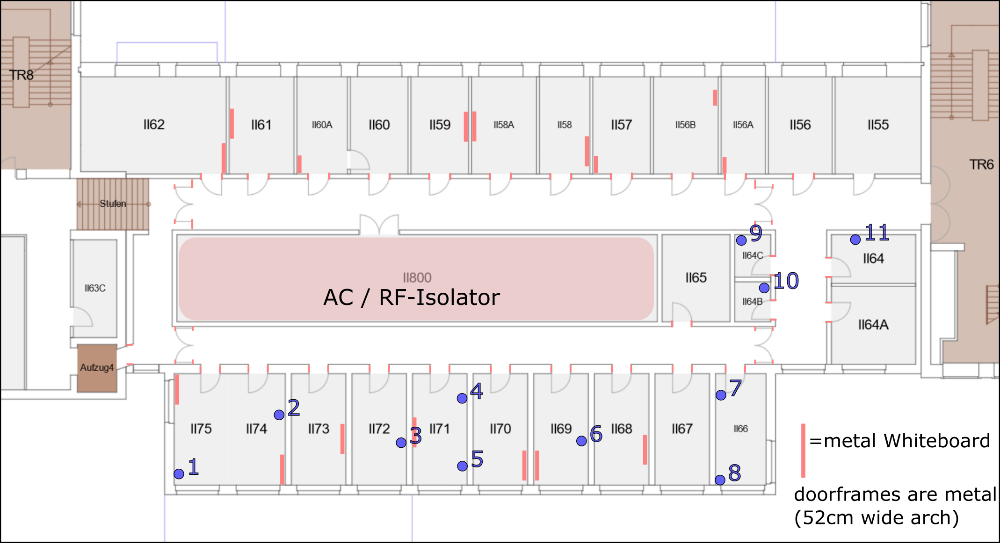

# Instance at TU Dresden

```{caution}
WORK IN PROGRESS
```

The initial deployment covered the ring of offices around the buildings ventilation system.
The inner structure mostly blocks RF due to lots of metal vents.
10 - 14 shepherd observers were used for the testrun.
Unfortunately the RF-Performance of the nodes was not strong enough to close the gap between II62 and II75 (left side of plan).

For now (Mai 2025) the testbed was reshaped to mimic an elongated multihop mesh-network on the lower part of the office-floor.

## Deployment

Below is a screenshot of the [Campus-Navigator](https://navigator.tu-dresden.de/etplan/bar/02) with marked node-positions.



Most horizontal walls are concrete, while the walls between offices are drywall.

## Link-Matrix

The link-matrix of the testbed looks like that:

```
Tx⟍Rx     1     2     3     4     5     6     7     8     9    10    11
     +-----------------------------------------------------------------
   1 |        -43   -57   -80   -62   -73   -86   -84
   2 |  -43         -45   -64   -56   -78   -81   -73
   3 |  -59   -46         -52   -47   -65   -72   -68
   4 |  -79   -62   -50         -41   -57   -65   -62
   5 |  -61   -55   -45   -41         -56   -71   -73
   6 |  -73   -77   -64   -58   -57         -55   -56
   7 |  -85   -80   -70   -65   -70   -53         -53   -78   -70
   8 |  -86   -74   -68   -64   -74   -57   -55         -77   -81
   9 |                                      -79   -76         -60   -75
  10 |                                      -72   -81   -61         -81
  11 |                                                  -75   -80
```

**Notes**:

- values are in dBm
- data is from 2025-03-11
- P_TX = 8 dBm
- [TrafficBench](https://github.com/nes-lab/TrafficBench) was used to make the rf-survey
- 8 min runtime, scheduler includes all nodes

## Changes in near Future

Currently new hardware is produced, validated and calibrated.

With the official public release of the testbed in June 2025 it is planned to roll out an extended layout:


### What does that mean for the user?

- number of observable GPIO from the target increases from 9 to 12, [see table here](https://github.com/orgua/shepherd-targets/tree/main/hardware/shepherd_nRF_FRAM_Target_v1.3)
- two power good lines to signal current state of the virtual source to the target ([similar to Riotee](https://www.riotee.nessie-circuits.de/docs/latest/hardware/module.html))
- usable node-count increases from 11 to 20+ for enabling more complex scenarios and a wider range of topologies
